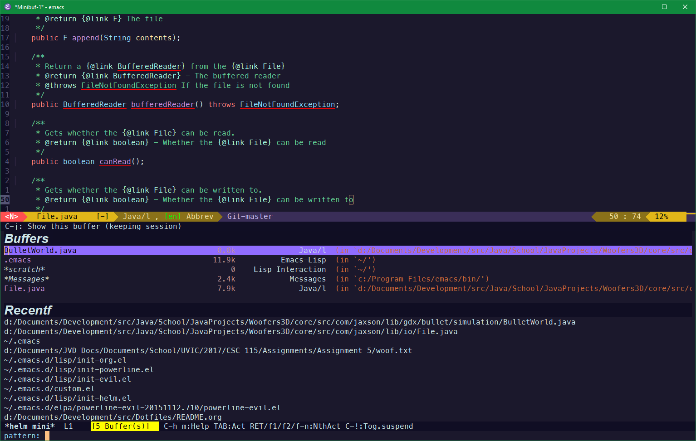

<h2>Table of Contents</h2>

<ul>
<li><a href="#sec-1">1. Custom Config and Theme files for:</a></li>
<li><a href="#sec-2">2. Emacs</a></li>
<li><a href="#sec-3">3. Neovim</a></li>
<li><a href="#sec-4">4. Mintty</a></li>
<li><a href="#sec-5">5. Tmux</a></li>
<li><a href="#sec-6">6. BASH and ZSH</a></li>
</ul>

# Custom Config and Theme files for:

-   [Emacs](https://www.gnu.org/software/emacs/)
-   [Neovim](https://github.com/neovim/neovim)
-   [wsl-terminal](https://github.com/goreliu/wsl-terminal) (Mintty)
-   [Tmux](https://github.com/tmux/tmux)
-   BASH (With [Powerline-Shell](https://github.com/banga/powerline-shell)),
-   ZSH (With [Oh My Zsh](https://github.com/robbyrussell/oh-my-zsh))

# Emacs

My Emacs setup consist of [challenger-deep](https://github.com/MaxSt/challenger-deep) as a theme with a custom [Powerline](https://github.com/milkypostman/powerline).
Emacs setup also heavly relies on [Helm](https://github.com/emacs-helm/helm)

# Neovim

Neovim config uses [dracula-vim](https://github.com/dracula/vim).
Airline theme is **light** from [airline-themes](https://github.com/vim-airline/vim-airline-themes).

# Mintty

Mintty uses [dracula-mintty](https://github.com/dracula/mintty) for its color definitions.

# Tmux

Tmux uses a modified version of [tmux-airline-dracula](https://github.com/sei40kr/tmux-airline-dracula) named **wracula** which matches **BASH** and **ZSH**.

# BASH and ZSH

This config contains a modified versions of both [agnoster-zsh-theme](https://github.com/agnoster/agnoster-zsh-theme) and [agnoster-bash](https://gist.github.com/kruton/8345450) dubbed *wagnoster* for **BASH** and **ZSH**.
LS Color are tweaked version of **dircolors.ansi-dark** from [Solarized Color Theme for GNU](https://github.com/seebi/dircolors-solarized).
ZSH addtionaly uses [zsh-syntax-highlighting](https://github.com/zsh-users/zsh-syntax-highlighting) package.
